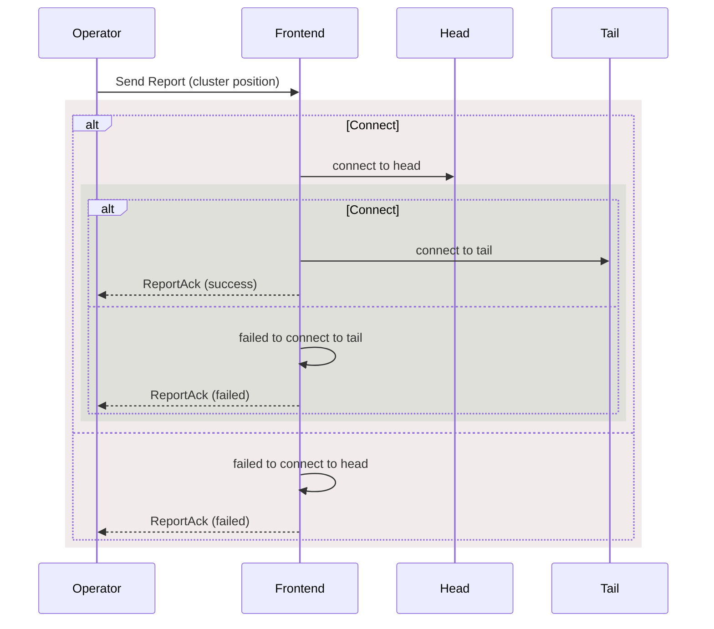
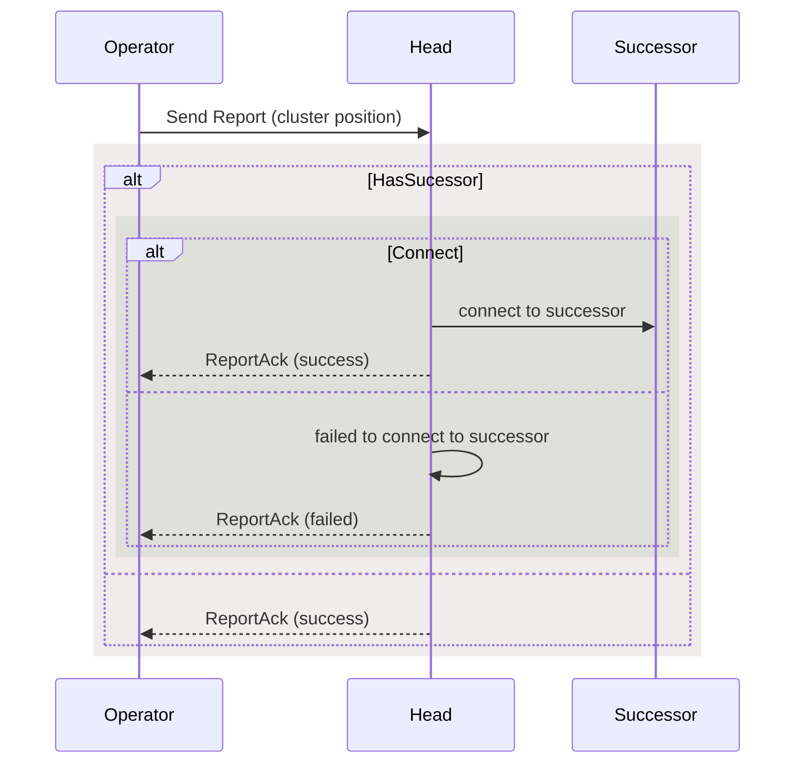
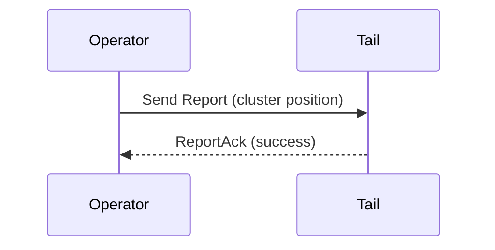

# necronomicon
This is the codec for [lichdom](https://github.com/nyanzoo/lichdom)

# Dequeue

# KV Store

# Operator
## Report
A command that is sent from the operator to nodes in the cluster to report their position in the cluster. After a node receives a `Report` it can begin connecting to other nodes in the cluster. `Report`s will be sent for every change to cluster, for example:
- A node joins the cluster
- A node leaves the cluster

### Frontend

### Head

### Middle
Same as [Head](#head)
### Tail

## Ping
A command that is sent from the operator to nodes in the cluster to check if they are still alive. If a node does not respond to a `Ping` it will be removed from the cluster.

## Transfer
Sent from `Operator` to `Tail` to request that it transfer its data to the `Candidate`. After the `Tail` has completed the transfer it will send a `Join` to the `Operator` to become a `Replica`.

## Join
This is sent from a Candidate node to the `Operator` to request to join the cluster after it has completed [Transfer](#transfer). After the `Operator` receives a `Join` it will send a `Report` to all nodes with the updated `Tail`. 

This also will be sent after [Transfer](#transfer) if the `Tail` has completed sending over its data to the `Candidate`. The `Report` as mentioned above will only be sent after getting both `Join`s from the `Tail` and `Candidate` nodes to maintain atomicity.